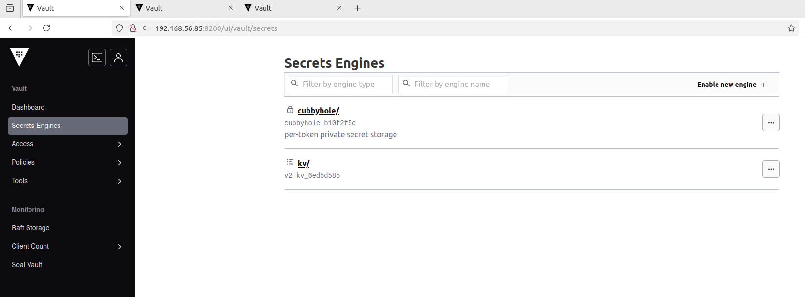

# Vault Cluster with Docker and RAFT Storage

This project sets up a Vault HA cluster using Docker Compose with three Vault nodes in a RAFT configuration.

Architecture

- vault-server1 (RAFT leader)

- vault-server2 (RAFT follower)

- vault-server3 (RAFT follower)

Each node is configured to use RAFT storage and runs in a Docker network to form a highly available cluster.

---

## Directory Structure for the Project

```
vault-cluster-by-docker/
├── docker-compose.yml
├── vault-server1/
│   ├── config/
│   │   └── config.hcl
│   ├── logs/
├── vault-server2/
│   ├── config/
│   │   └── config.hcl
│   ├── logs/
├── vault-server3/
│   ├── config/
│   │   └── config.hcl
│   ├── logs/
```

***

docker-compose.yml

```
name: my-vault-cluster

services:
  vault-server1:
    image: hashicorp/vault:1.17
    hostname: vault-server1
    container_name: vault-server1
    ports:
      - "8200:8200"
    cap_add:
      - IPC_LOCK
    networks:
      - vault-cluster-network
    environment:
      - VAULT_ADDR=http://0.0.0.0:8200
    volumes:
      - ./vault-server1/config:/vault/config
      - vault1-filestorage:/vault/file
      - ./vault-server1/logs:/vault/logs
    entrypoint: vault server -config=/vault/config/config.hcl

  vault-server2:
    image: hashicorp/vault:1.17
    hostname: vault-server2
    container_name: vault-server2
    ports:
      - "8202:8200"
    cap_add:
      - IPC_LOCK
    networks:
      - vault-cluster-network
    environment:
      - VAULT_ADDR=http://0.0.0.0:8200
    volumes:
      - ./vault-server2/config:/vault/config
      - vault2-filestorage:/vault/file
      - ./vault-server2/logs:/vault/logs
    entrypoint: vault server -config=/vault/config/config.hcl

  vault-server3:
    image: hashicorp/vault:1.17
    hostname: vault-server3
    container_name: vault-server3
    ports:
      - "8204:8200"
    cap_add:
      - IPC_LOCK
    networks:
      - vault-cluster-network
    environment:
      - VAULT_ADDR=http://0.0.0.0:8200
    volumes:
      - ./vault-server3/config:/vault/config
      - vault3-filestorage:/vault/file
      - ./vault-server3/logs:/vault/logs
    entrypoint: vault server -config=/vault/config/config.hcl

networks:
  vault-cluster-network:
    driver: bridge

volumes:
  vault1-filestorage:
  vault2-filestorage:
  vault3-filestorage:
```
---
## Vault Configuration Files

***vault-server1/config/config.hcl***

```
storage "raft" {
  path = "/vault/file"
  node_id = "node1"
}

listener "tcp" {
  address = "0.0.0.0:8200"
  tls_disable = true
}

api_addr = "http://vault-server1:8200"
cluster_addr = "http://vault-server1:8201"
cluster_name = "sg-vault-cluster"

ui = true
log_level = "debug"
```

***vault-server2/config/config.hcl***

```
storage "raft" {
  path = "/vault/file"
  node_id = "node2"
}

listener "tcp" {
  address = "0.0.0.0:8200"
  tls_disable = true
}

api_addr = "http://vault-server2:8200"
cluster_addr = "http://vault-server2:8201"
cluster_name = "sg-vault-cluster"

ui = true
log_level = "debug"
```
***vault-server3/config/config.hcl***

```
storage "raft" {
  path = "/vault/file"
  node_id = "node3"
}

listener "tcp" {
  address = "0.0.0.0:8200"
  tls_disable = true
}

api_addr = "http://vault-server3:8200"
cluster_addr = "http://vault-server3:8201"
cluster_name = "sg-vault-cluster"

ui = true
log_level = "debug"
```
---
## Step 1: Clone the Repository
```
git clone https://github.com/yourusername/vault-cluster-by-docker.git
cd vault-cluster-by-docker
```
## Step 2: Start the Vault Cluster
Use docker-compose to launch the cluster.
```
docker-compose up -d
```
## Step 3: Initialize Vault (Only on Leader - vault-server1)
```
docker exec -it vault-server1 vault operator init
```
This will generate unseal keys and a root token. Save them securely.

## Step 4: Unseal Vault on All Nodes by using at least 3 unseal keys
Unseal vault-server1
```
docker exec -it vault-server1 vault operator unseal <UNSEAL_KEY>
```
Unseal vault-server2
```
docker exec -it vault-server2 vault operator unseal <UNSEAL_KEY>
```
Unseal vault-server3
```
docker exec -it vault-server3 vault operator unseal <UNSEAL_KEY>
```
## Step 5: Join vault-server2 and vault-server3 to the Cluster
```
docker exec -it vault-server2 vault operator raft join http://vault-server1:8200
docker exec -it vault-server3 vault operator raft join http://vault-server1:8200
```
## Step 6: Verify the Cluster
```
docker exec -it vault-server1 vault operator raft list-peers

Node     Address               State       Voter
----     -------               -----       -----
node1    vault-server1:8201    leader      true
node2    vault-server2:8201    follower    true
node3    vault-server3:8201    follower    false
```
You should see three nodes in the cluster.

Create KV secrets in vault-server1 and check in vault-server2 and vault-server3

We can see that changes are synchronizing across vault servers.

vault-server1


vault-server2


vault-server3


## Conclusion

You have successfully deployed a Vault HA cluster with RAFT storage using Docker Compose. This setup provides a highly available and fault-tolerant Vault environment.
